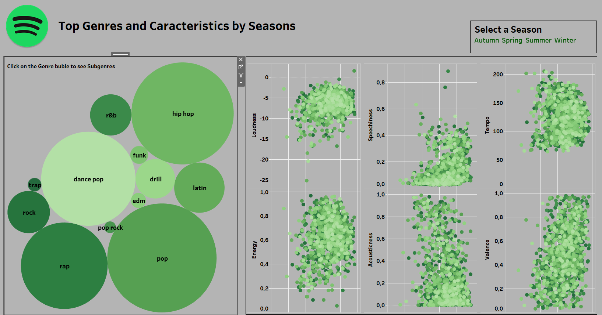
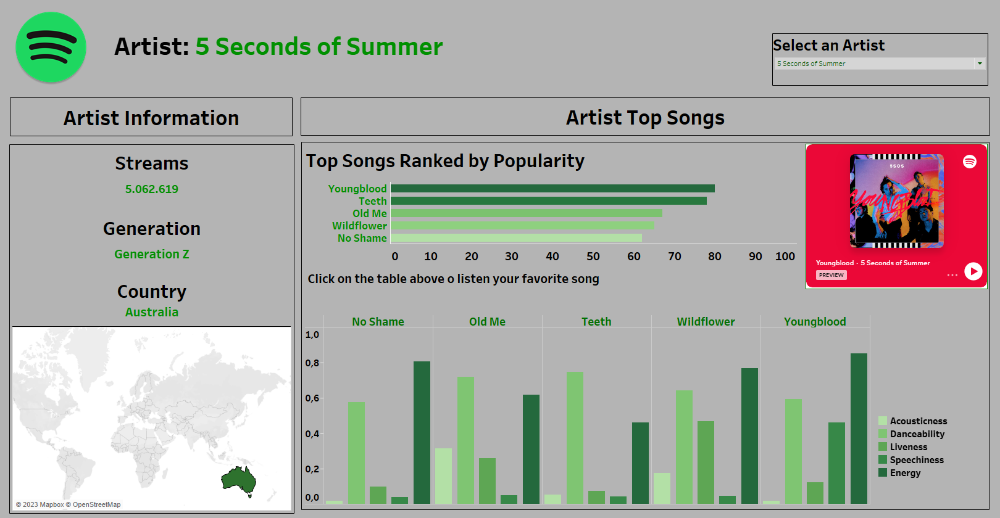
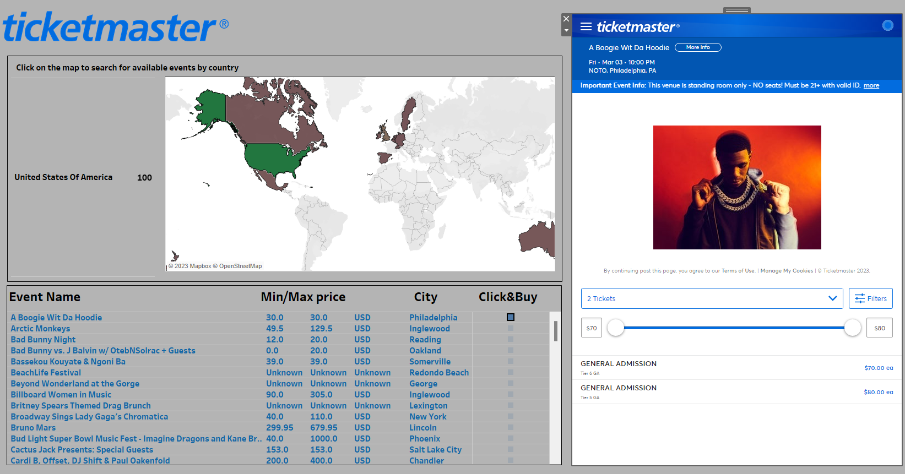

# Project-2: TOP SONGS & ARTISTS DATA VISUALISATION

**Objective**: The Objective of this proyect it to visualise the dataset generated in the ETL Project: [TOP SONGS & ARTISTS DATA ANALYSIS](https://github.com/elisagomezcambronero/Project-Top_Spotify_Songs_and_Artists) using Tableau. 

The aim is to produce **interactive dashboards** containing information from top songs/artits/events that will provide you interesting insights about what has been trending in the world of music over the last year. 
This visualization project combines information from one of the world's top digital music streaming service, Spotify, and one of the largest ticket marketplaces, Ticketmaster. 

## Repository Structure

- [Data folder](data): this will include the dataset used for the project
- [Image](image): this folder will include the images used for Tableau and for the Readme 
- [Notebook](notebook): Jupyter notebook with coding to get the additional datasets used for the project.
- Tableau Dashboard will be included in a link to Tableau Public at the end of this read me. 

## Datasets
Three Datasets are used for this visualisation proyect:
- df_visualisacion: dataset generated in my ETL Proyect: [TOP SONGS & ARTISTS DATA ANALYSIS](https://github.com/elisagomezcambronero/Project-Top_Spotify_Songs_and_Artists)
df_country_codes: dataset with the country name with its ISO country code.
- df_id: dataset that gives the songs spotify ids taking information from the [Kaggle Data Set](https://www.kaggle.com/datasets) **"Spotify Top 200 Charts (2020-2021)"** generated in [Extra Dataset Jupyter Notebook](notebook/extra_dataset_tableau)
- df_ticketmaster_artists: dataset with information about the ticketmaster events (using ticketmaster API) generated in [Extra Dataset Jupyter Notebook](notebook/extra_dataset_tableau)
- df_country_codes: dataset with the country name with its ISO country code.

# Visualising Top Songs & Artists & Events in Tableau

This Tableau Project consist of a Tableau History of three interactive dashboards (and a Introduction) where you can play to get the information that you want!! 

##  Introduction Dashboard
On the Tableau project introduction dashboard, we have included a visualization that showcases the goal of this project.

##  Top Genres & Caracteristics

This dashboard displays top genres and characteristics of popular songs on Spotify. Users can **filter** the dashboard by **year seasons** to see if consumer preferences change. The dataset used for this dashboard contains information about the top charts of the past years. With interactive features, users can dive into the data to gain valuable insights about the most popular genres and song characteristics of the past years.

##  Top Artists Information

The second dashboard showcases information about artists. Users can filter the dashboard by their preferred artist to view data about them. With this dashboard, users can gain valuable insights into the most popular artists of the past years, such as their genres and characteristics of their popular songs.

##  Click & Buy Ticketmaster

The third  dashboard includes data from Ticketmaster. Users can select a country and view a list of events. By clicking on a specific event, a window will open, allowing the user to purchase tickets. With this interactive dashboard, users can easily find and purchase tickets for events in their desired location. 

With these interactive dashboards, users can gain a deeper understanding of the music industry and live events, providing a unique and engaging user experience. I hope you enjoy exploring this project!

